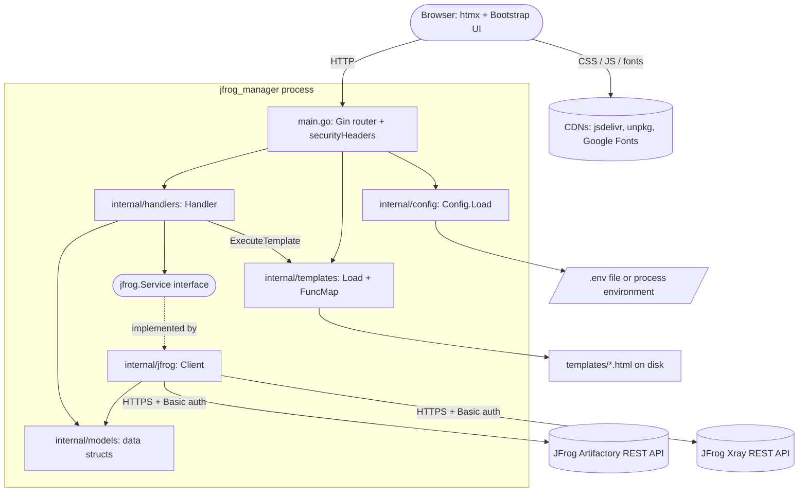
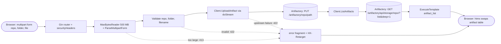

# ARCHITECTURE.md — JFrog Manager

How the system is built and why. Keep this in sync with the code: when a component,
data flow, integration, or dependency changes, update the matching section here and
the relevant diagram in [docs/diagrams/](docs/diagrams/).

> Audience: engineers and reviewers.
> Rule: diagrams and prose must match the code. Mark unverified parts `TODO:`.

---

## 1. System overview

JFrog Manager is a web-based admin tool for JFrog Artifactory: it lets a browser user
browse repositories, list, upload, download and delete artifacts (single or bulk), and
view Xray vulnerability information (`README.md`). It is a single Go process
(module `jfrog_manager`, `go.mod`) built on Gin that renders HTML on the server and
returns HTML fragments for htmx partial swaps; it has no JSON API of its own
(`main.go`, `internal/handlers/artifacts.go`, `templates/`).

The process is a stateless proxy in front of one configured JFrog instance. It owns
routing, input validation, request size limits, HTML rendering and the translation of
UI actions into Artifactory / Xray REST calls (`main.go`, `internal/handlers/`,
`internal/jfrog/`). Out of scope, because no code for them exists in the repository:
persistent storage (no database), user accounts and application-level authentication
(`README.md` "Security notes"), and any per-user JFrog credentials — one credential set
from the environment is used for every request (`internal/config/config.go`,
`internal/jfrog/client.go`).

## 2. Component diagram

| Component | Responsibility | Source location |
|-----------|----------------|-----------------|
| Entry point and router | Defaults Gin to release mode when `GIN_MODE` is unset, loads config, builds the JFrog client, loads templates, registers the eight routes, sets `MaxMultipartMemory` to 32 MB and installs the `securityHeaders` middleware | `main.go` |
| Config | Loads `.env` via godotenv (falls back to process environment), validates required `JFROG_URL`, `JFROG_USERNAME`, `JFROG_TOKEN`, applies defaults for `PORT` (8080) and `TIMEOUT` (30 s), reads optional `DEFAULT_REPO` | `internal/config/config.go` |
| HTTP handlers | `Handler` struct (`service`, `tmpl`, `defaultRepo`); validates query/form/JSON input, enforces size limits, calls the service, renders HTML fragments, and maps failures to the `error` fragment via `renderError` | `internal/handlers/artifacts.go`, `internal/handlers/xray.go` |
| Service interface | `jfrog.Service` — `ListRepos`, `ListArtifacts`, `UploadArtifact`, `DeleteArtifact`, `DownloadArtifact`, `GetXraySummary`; the seam handlers depend on, declared "for testability" | `internal/jfrog/service.go` |
| JFrog client | `Client` implementing `Service`; holds two `http.Client`s (one with the configured timeout, one without for streaming), injects HTTP Basic auth, builds and escapes upstream URLs, parses JSON responses | `internal/jfrog/client.go`, `internal/jfrog/artifacts.go`, `internal/jfrog/xray.go` |
| Models | Plain data structs shared by client, handlers and templates (repositories, artifacts, Xray summary and issues) | `internal/models/models.go` |
| Template loader | `Load` globs `*.html` and `partials/*.html` under the given directory and fails at startup if none are found; `FuncMap` provides `toLower`, `urlEncode`, `humanSize`, `cssID`, `countBySeverity`, `sortBySeverity` | `internal/templates/templates.go` |
| HTML templates | Named templates `layout`, `content`, `artifact_list`, `error`, `xray_panel`, `upload_form`; the page loads Bootstrap 5.3.3, htmx 2.0.4 and Google Fonts from CDNs and issues `fetch` calls for bulk delete | `templates/layout.html`, `templates/index.html`, `templates/partials/` |
| Release pipeline | Tag-triggered GoReleaser build of cross-platform binaries | `.github/workflows/release.yml`, `.goreleaser.yaml` |

Routes registered in `setupRouter` (`main.go`):

| Method | Path | Handler | Response |
|--------|------|---------|----------|
| GET | `/` | `Index` | Full page (`layout` template) |
| GET | `/repos` | `ListRepos` | `<option>` elements for the repository dropdown |
| GET | `/artifacts` | `ListArtifacts` | `artifact_list` fragment |
| POST | `/artifacts/upload` | `UploadArtifact` | `artifact_list` fragment after upload |
| POST | `/artifacts/bulk-delete` | `BulkDeleteArtifacts` | `artifact_list` fragment after deletes |
| GET | `/artifacts/download` | `DownloadArtifact` | Streamed artifact bytes with `Content-Disposition: attachment` |
| DELETE | `/artifacts` | `DeleteArtifact` | Empty 200 body (htmx removes the row) |
| GET | `/xray` | `GetXray` | `xray_panel` fragment |

## 3. Data flow

Representative flow: uploading an artifact (`POST /artifacts/upload`).

1. The browser submits a multipart form with fields `repo`, `folder` (optional) and
   `file`. Gin routes it to `Handler.UploadArtifact` after `securityHeaders` has set
   the response headers (`main.go`).
2. The handler wraps the request body in `http.MaxBytesReader` with a 500 MB limit and
   calls `ParseMultipartForm` explicitly so that an oversized body is detected as
   `*http.MaxBytesError` and answered with HTTP 413 and the `error` fragment. Parts
   larger than the router's 32 MB `MaxMultipartMemory` spill to disk rather than RAM
   (`internal/handlers/artifacts.go`, `main.go`).
3. Input is validated: `repo` is required, `repo` and `folder` must not contain `..`,
   and the filename is reduced to `path.Base` of the uploaded name. The upload path is
   `folder/filename`, or just `filename` when no folder is given
   (`internal/handlers/artifacts.go`).
4. `Client.UploadArtifact` issues `PUT {base}/artifactory/{repo}/{path}` through
   `doStream`, which uses the `http.Client` without an overall timeout and injects
   Basic auth. The repo is escaped with `url.PathEscape` and each path segment is
   escaped individually by `escapePathSegments`, preserving slashes. A non-2xx status
   becomes an error containing the upstream status and body
   (`internal/jfrog/client.go`).
5. On success the handler calls `ListArtifacts(repo)`, which issues
   `GET {base}/artifactory/api/storage/{repo}/?list&deep=1` with the timeout-bound
   client, skips folders, `repomd.xml` and `*.xml.gz` entries, and returns
   `[]models.Artifact` (`internal/jfrog/client.go`).
6. The handler renders the `artifact_list` template with the refreshed list and
   returns it as `text/html` with status 200 (`internal/handlers/artifacts.go`,
   `templates/partials/artifact_list.html`).
7. On an upstream failure the error is logged with `slog` and the browser receives a
   generic message through `renderError` (validation failures use the same path but
   are not logged): HTTP 422, the `error` fragment, and headers
   `HX-Retarget: #error-container` and `HX-Reswap: innerHTML` so htmx places it in the
   error container instead of the triggering element
   (`internal/handlers/artifacts.go`).

Nothing is stored by the application itself; Artifactory is the system of record.

## 4. External integrations

| Integration | Direction | Protocol | Notes |
|-------------|-----------|----------|-------|
| JFrog Artifactory — list repositories | out | HTTP(S) REST, Basic auth, JSON response | `GET {JFROG_URL}/artifactory/api/repositories` (`internal/jfrog/artifacts.go`) |
| JFrog Artifactory — list artifacts | out | HTTP(S) REST, Basic auth, JSON response | `GET {JFROG_URL}/artifactory/api/storage/{repo}/?list&deep=1` (`internal/jfrog/client.go`) |
| JFrog Artifactory — upload / download / delete | out | HTTP(S) REST, Basic auth, binary body | `PUT` / `GET` / `DELETE {JFROG_URL}/artifactory/{repo}/{path}`; upload and download use the no-timeout streaming client (`internal/jfrog/client.go`) |
| JFrog Xray — artifact summary | out | HTTP(S) REST, Basic auth, JSON request and response | `POST {JFROG_URL}/xray/api/v1/summary/artifact` with body `{"paths":["default/{repo}/{path}"]}`; `default` is the hard-coded JFrog service ID (`internal/jfrog/xray.go`) |
| Browser clients | in | HTTP, HTML responses | Eight routes listed in section 2; no OpenAPI spec exists (`main.go`) |
| jsDelivr CDN | browser out | HTTPS | Bootstrap 5.3.3 CSS and JS bundle, loaded by the browser, not the server (`templates/layout.html`) |
| unpkg CDN | browser out | HTTPS | htmx 2.0.4 (`templates/layout.html`) |
| Google Fonts | browser out | HTTPS | Source Sans 3 and IBM Plex Mono (`templates/layout.html`) |

The scheme used for the JFrog calls is whatever `JFROG_URL` specifies; the code does
not enforce HTTPS (`internal/config/config.go`, `internal/jfrog/client.go`).

## 5. Service dependencies

- **Internal services this depends on:** none found in the repository. The only
  backend is the JFrog Platform instance at `JFROG_URL` (`internal/config/config.go`).
  TODO: confirm whether that instance is an internal service and who operates it.
- **Third-party / infra dependencies:**
  - Go modules: `github.com/gin-gonic/gin` v1.12.0 and `github.com/joho/godotenv`
    v1.5.1 are the only direct dependencies (`go.mod`).
  - JFrog Artifactory and JFrog Xray REST APIs (section 4).
  - Browser-side CDNs: jsDelivr, unpkg, Google Fonts (`templates/layout.html`). The
    UI depends on them being reachable from the user's browser.
  - The `templates/` directory on disk, resolved relative to the working directory
    (`templates.Load("templates")` in `main.go`). Templates are not embedded in the
    binary (`internal/templates/templates.go`), so the GoReleaser archives ship
    `templates/` alongside it (`.goreleaser.yaml`) and a released binary must be started
    from its unpacked directory.
  - No database, cache, queue, Dockerfile or orchestration manifests exist in the
    repository.
- **Failure modes & fallbacks:**
  - Missing required configuration, an invalid `TIMEOUT`, or no templates found:
    the process logs the error and exits with status 1 at startup (`main.go`,
    `internal/config/config.go`, `internal/templates/templates.go`).
  - Artifactory request error or non-2xx status: the client returns a wrapped error;
    the handler logs it and returns HTTP 422 with a generic `error` fragment
    (`internal/jfrog/client.go`, `internal/handlers/artifacts.go`). There are no
    retries.
  - Xray unreachable, 404, or any non-2xx: `GetXraySummary` returns
    `XraySummary{Available: false}` with a nil error, so the panel still renders;
    only a malformed 2xx body is surfaced as an error (`internal/jfrog/xray.go`).
  - Bulk delete: paths are deleted one by one; failures are collected and reported
    together, and deletes that already succeeded are not rolled back
    (`internal/handlers/artifacts.go`).
  - Upload succeeded but list refresh failed: reported as "Upload succeeded but
    failed to refresh list" (`internal/handlers/artifacts.go`).
  - Download stream interrupted after headers were sent: logged only; the status
    code has already been written as 200 (`internal/handlers/artifacts.go`).
  - Short API calls are bounded by `TIMEOUT` (default 30 s); upload and download
    have no overall timeout by design (`internal/jfrog/client.go`).
  - TODO: no health-check endpoint, graceful shutdown handling, or monitoring
    integration was found in the code; confirm operational expectations.

## 6. Scalability considerations

- **Expected load / scaling dimension:** TODO: no load expectations, capacity
  targets or SLAs are documented in the repository.
- **Bottlenecks & how they're addressed:**
  - Artifact listing uses a deep storage listing (`?list&deep=1`) and renders the
    whole result in one fragment with no pagination, so cost grows with repository
    size (`internal/jfrog/client.go`, `internal/handlers/artifacts.go`).
  - Uploads are capped at 500 MB per request; multipart data above 32 MB is spilled
    to disk instead of held in memory (`internal/handlers/artifacts.go`, `main.go`).
  - Downloads are streamed from Artifactory to the browser with `io.Copy` rather
    than buffered (`internal/handlers/artifacts.go`).
  - Bulk delete is limited to a 1 MiB body and 500 paths per request and issues one
    sequential upstream `DELETE` per path (`internal/handlers/artifacts.go`).
  - Repository and artifact list responses are read fully into memory before
    parsing (`doAndReadBody` in `internal/jfrog/client.go`).
  - TODO: no rate limiting, concurrency limit or caching exists in the code; confirm
    whether any is required.
- **Statefulness / partitioning / batching:** the process keeps no session or
  application state; the `Handler` and `Client` structs hold only configuration
  values, the parsed templates and HTTP clients (`internal/handlers/artifacts.go`,
  `internal/jfrog/client.go`). Local disk is used only for the `.env` file, the
  templates, and temporary multipart spill files. TODO: whether multiple instances
  are run behind a load balancer is not documented.

## 7. Security architecture

- **Trust boundaries:**
  - Browser to jfrog_manager: unauthenticated. Anyone who can reach `PORT` acts with
    the full rights of the configured JFrog credentials (`README.md` "Security
    notes"). The boundary is expected to be enforced outside the process — the README
    says to deploy behind a VPN, an SSO reverse proxy, or on `127.0.0.1` with an
    authenticating proxy in front.
  - jfrog_manager to JFrog: authenticated with a single service credential
    (`internal/jfrog/client.go`).
  - Browser to third-party CDNs: scripts and styles are loaded from jsDelivr, unpkg
    and Google Fonts without `integrity` attributes (`templates/layout.html`).
- **AuthN / AuthZ flow:** there is no application-level authentication or
  authorization (`README.md`; no auth middleware in `main.go`). Every upstream
  request gets HTTP Basic auth with `JFROG_USERNAME` and `JFROG_TOKEN` via
  `req.SetBasicAuth` in `Client.Do` and `Client.doStream`
  (`internal/jfrog/client.go`); effective permissions are whatever that JFrog account
  is granted. TODO: document the intended fronting proxy / identity provider, if any.
- **Secrets & key management:** `JFROG_TOKEN` is read from `.env` in the working
  directory or from the process environment (`internal/config/config.go`,
  `.env.example`) and held in memory in the `Client` struct. The README advises
  keeping `.env` at mode 600. TODO: confirm that `.env` is excluded from version
  control and document token rotation and any secret-manager integration — none is
  implemented in code.
- **Network exposure / surface:**
  - Listens on all interfaces at `:PORT` (default 8080) over plain HTTP via
    `r.Run(":" + cfg.Port)`; TLS is not terminated by the process (`main.go`).
  - Every response carries `X-Content-Type-Options: nosniff`,
    `X-Frame-Options: DENY` and `Referrer-Policy: no-referrer` (`securityHeaders` in
    `main.go`).
  - Request limits: 500 MB upload cap, 1 MiB bulk-delete body cap, 500 paths per
    bulk delete (`internal/handlers/artifacts.go`).
  - Input validation: handlers reject `repo`, `path` and `folder` values containing
    `..`; upload filenames are reduced with `path.Base`
    (`internal/handlers/artifacts.go`, `internal/handlers/xray.go`). Upstream URLs
    are built with `url.PathEscape` per segment (`internal/jfrog/client.go`).
  - Output encoding: fragments are rendered through `html/template`; the
    hand-written `<option>` output in `ListRepos` uses `template.HTMLEscapeString`;
    DOM ids derived from artifact paths go through the `cssID` template function
    (`internal/handlers/artifacts.go`, `internal/templates/templates.go`).
  - Downloads are sent with `Content-Disposition: attachment` and the upstream
    content type, defaulting to `application/octet-stream`
    (`internal/handlers/artifacts.go`).
  - Upstream error bodies are logged server-side and replaced with generic messages
    in the browser response (`internal/handlers/artifacts.go`).
  - No CSRF protection, Content-Security-Policy header or CORS configuration is
    present in `main.go`. TODO: confirm whether these are required given the
    intended deployment.
- **Audit / logging of sensitive actions:** logging is via `log/slog` plus Gin's
  default request logger (`gin.Default()` in `main.go`). Failures of upload, delete,
  bulk delete, download and Xray calls are logged at error or warn level
  (`internal/handlers/`, `internal/jfrog/xray.go`); successful mutating actions get
  no dedicated audit entry beyond the Gin access-log line, and no user identity is
  recorded because none exists. Gin is defaulted to release mode specifically to
  avoid debug output (`main.go`). TODO: define audit requirements and log
  destination / retention.

## 8. Key decisions

Significant, hard-to-reverse choices are recorded as ADRs in
[docs/decisions/](docs/decisions/). Link the relevant ones here as they accrue.

No ADRs have been recorded yet; `docs/decisions/` contains only `adr-template.md`.
The original implementation plan is in
[docs/plans/completed/20260330-jfrog-manager.md](docs/plans/completed/20260330-jfrog-manager.md).

Decisions visible in the code that are candidates for ADRs (rationale is quoted from
code comments where one exists; otherwise it is not recorded):

- Handlers depend on the `jfrog.Service` interface rather than the concrete client,
  "for testability" (`internal/jfrog/service.go`).
- Two HTTP clients: a timeout-bound one for short API calls and one with no overall
  timeout, because large uploads and downloads "can legitimately take longer than the
  short API timeout" (`internal/jfrog/client.go`).
- Xray failures degrade to `Available: false` instead of an error
  (`internal/jfrog/xray.go`).
- Gin defaults to release mode because debug mode "leaks URL query params into
  stdout" (`main.go`).
- Server-rendered HTML fragments with htmx instead of a JSON API (`README.md`,
  `internal/handlers/`). TODO: record the rationale.
- Templates loaded from disk at startup rather than embedded in the binary
  (`internal/templates/templates.go`). TODO: record the rationale. The release
  archives ship `templates/` alongside the binary (`.goreleaser.yaml`).
- No application-level authentication; access control is delegated to the deployment
  environment (`README.md`). TODO: record the rationale and the approved deployment
  patterns.
