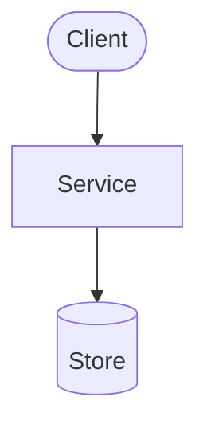

# Diagrams

Source-controlled diagrams for this project. Prefer **text-based** diagrams so they
diff and review like code and never drift into a binary nobody can edit.

## Convention

- **Format:** Mermaid (` ```mermaid ` blocks in `.md`) or PlantUML (`.puml`).
- **Naming:** `kebab-case.md` / `kebab-case.puml` describing the view
  (e.g. `component-overview.md`, `request-data-flow.md`).
- **Keep them current:** a diagram that contradicts the code is worse than none.
  Update the diagram in the same change that changes the structure it shows.
- Reference diagrams from `ARCHITECTURE.md` rather than duplicating them.

## Current state

No diagram sources exist in this repository yet: a search of the working tree found no
`.puml`, `.plantuml`, `.mmd`, `.drawio` or `.svg` files and no ` ```mermaid ` or
`@startuml` blocks in any tracked file. Before this file was added, `docs/` contained
only `docs/decisions/` and `docs/plans/`.

TODO: add the first diagram(s) from the table below and list them here with a one-line description each.

## Recommended diagrams

| Diagram | Shows | Sources to draw it from |
|---------|-------|-------------------------|
| `component-overview` | Major components and their relationships | `main.go` (routes, middleware), `internal/handlers/`, `internal/jfrog/service.go`, `internal/jfrog/client.go`, `internal/templates/templates.go`, `templates/` |
| `request-data-flow` | End-to-end path of a representative request/record | `main.go` (`setupRouter`), `internal/handlers/artifacts.go`, `internal/handlers/xray.go`, `internal/jfrog/artifacts.go`, `internal/jfrog/xray.go` |
| `deployment-topology` | Where things run and how they connect | TODO: no deployment manifests (Dockerfile, docker-compose, Kubernetes/Helm) exist in the repository; a human must supply the real topology before this diagram can be drawn. |

## Example (Mermaid)

The block below only illustrates the syntax. It is a generic placeholder, not a view of
this project.


